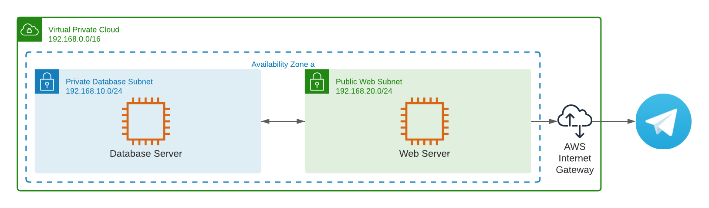
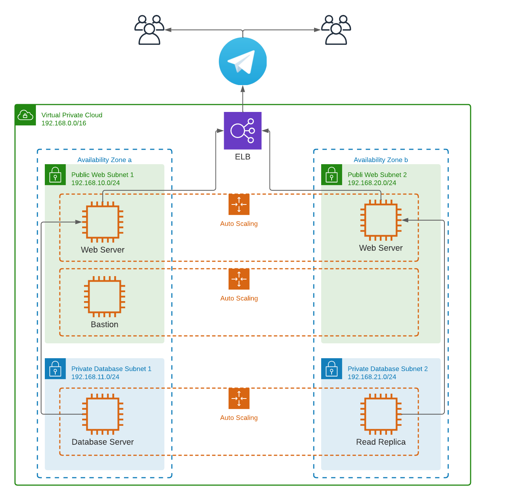

# DelftSecure

<h2>Disclaimer: Данный проект является оттачиванием навыков и нахождений моих слабостей в процессе изучения Terraform.
Пока в данном README присутсвует этот дисклеймер, используйте его на свой страх и риск</h2>

DelftSecure - это личное хранилище паролей, которое управляется с помощью бота в Telegram.
Отличительной особенностью этого хранилища является то, что пароли клиентов хранятся не централизованно
в базе данных владельцев бота, которых клиент даже не видел в лицо, а в личной базе клиента. Это достигается тем, что клиент автоматически
создает облачную инфраструктуру за считанные минуты и начинает пользоваться хранилищем.

Плюсы:
  1. Клиент может быть уверен, что проект не будет закрыт, т.к. им владеют не сторонние люди;
  2. Инфраструктура создается с использованием ресурсов облачного провайдера AWS, который гарантирует uptime в ~99.9%;
  3. Можно лично убедиться, что данные надежно шифруются и даже внедрить свои усиленные методы защиты при навыках программирования.
Минусы:
  1. Пользование таким хранилищем будет платным, т.к. необходимо оплачивать используемые ресурсы.
 
 На данный момент архитектура, которую реализует terraform выглядит так:
​

Данная архитектура располагается только в одной AZ, т.к. для личного пользования этого более чем достаточно.

В случае, если ботом будет пользоваться множество людей рекомендуется использовать следующую архитектуру: 
​

## Инструкция по эксплуатации
Перед началом вы должны иметь: 
1. аккаунт в AWS
2. Установленный Terraform
3. Установленный git
4. Токен бота Telegram

Использование:
1. git clone github.com/Botiyava/DelftSecure
2. cd DelftSecure/terraform
3. ssh-keygen -t rsa
  3.1 delft
  3.2 enter
  3.3 enter
4. terraform init
5. terraform apply --auto-approve
На экран будет выведен ip адрес, далее <ip>
6. ssh -i delft ubuntu@<ip>
  6.1 yes
7. cd DelftSecure && screen -dm bash -c "go run cmd/main.go"
8. exit
 
## Будет сделано в будущем
  1. Запуск кода (п. 6-8) будет полностью автоматическим
  2. Будет добавлен Bastion(jumpbox) для веб-сервера, либо доступ по ssh к нему будет убран вовсе
  3. Отсоединение и присоединение диска сервера с базой данных при уничтожении/повторном запуске инфраструктуры
  4. Скрипт, выполняющий пункты 3-5 автоматически
